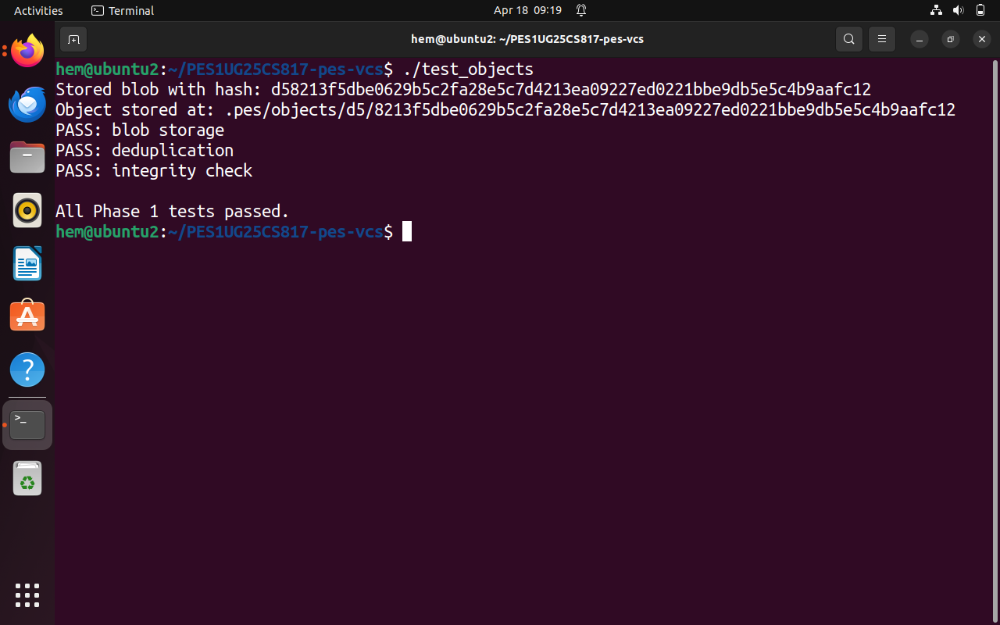
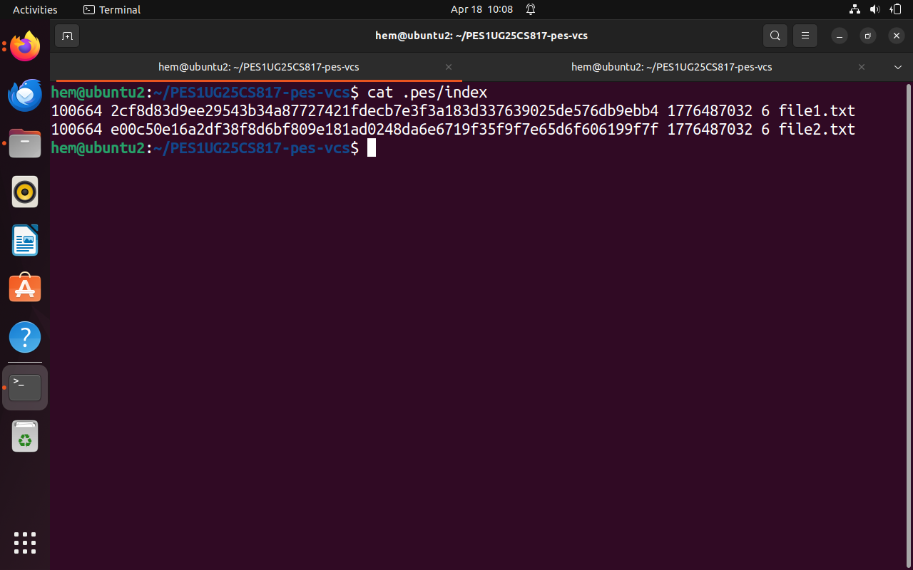

# PES Version Control System (PES-VCS)

## Overview

This project is a simplified implementation of a Git-like version control system developed as part of a lab exercise. The objective of this project is to understand how version control systems internally manage data such as files, directories, and commits using content-addressable storage.

The system supports fundamental operations such as adding files, creating commits, and viewing commit history.

---

## Features Implemented

* Object storage using SHA-256 hashing
* Blob, Tree, and Commit object handling
* Index (staging area) management
* Commit creation with parent linking
* Commit history traversal using `pes log`

---

## Phase-wise Implementation

### Phase 1: Object Storage

In this phase, the core object storage system was implemented:

* Files are stored as blob objects
* Each object is identified using a SHA-256 hash
* Objects are stored inside `.pes/objects/`

---

### Phase 2: Tree Structure

* Tree objects represent directory structures
* Each tree stores file metadata (mode, name, hash)
* Serialization and parsing of tree objects were implemented

---

### Phase 3: Index (Staging Area)

* Implemented an index file (`.pes/index`)
* Supports:

  * Adding files (`pes add`)
  * Saving and loading index entries
* Acts as an intermediate stage before committing

---

### Phase 4: Commit System

* Implemented commit creation with:

  * Tree reference
  * Parent commit linkage
  * Author and timestamp
* Implemented `pes log` to traverse commit history

---

## Screenshots

### Phase 1

#### 1A - Test Objects

#### 1B - Object Store

---

### Phase 2

#### 2A - Tree Test

#### 2B - Tree Object Hex

---

### Phase 3

#### 3A - PES Status

#### 3B - Index File

---

### Phase 4

#### 4A - PES Log

#### 4B - Object Growth

#### 4C - References

---

## Key Concepts Learned

* Content-addressable storage
* Difference between blob, tree, and commit objects
* Internal working of version control systems
* Role of staging area (index)
* Parent-child relationship in commit history

---

## Challenges Faced

* Debugging segmentation faults due to incorrect memory handling
* Understanding object serialization formats
* Resolving function signature mismatches (e.g., `object_write`)
* Managing correct data flow between index, tree, and commit

---

## Conclusion

This project provided a strong understanding of how version control systems like Git function internally. Building each component step-by-step helped in understanding how data is stored, tracked, and retrieved efficiently.

---

## Phase 5 & 6: Analysis Questions

### Branching and Checkout

#### Q5.1: How would you implement `pes checkout <branch>`? What makes this operation complex?

A branch is represented as a file inside `.pes/refs/heads/` containing a commit hash. To implement `pes checkout <branch>`, the system must first verify that the branch exists. Then, the `.pes/HEAD` file must be updated to point to the selected branch reference.

The commit hash is read from the branch file, and the corresponding commit object is loaded to obtain the root tree. The working directory is then updated by removing tracked files and recreating them from the target tree’s blob objects. The index is also updated to reflect this new state.

This operation is complex because it requires synchronization between the working directory, index, and object store. It must prevent overwriting uncommitted changes, preserve untracked files, and correctly reconstruct directory structures.

---

#### Q5.2: How can a "dirty working directory" conflict be detected?

A dirty working directory is detected by comparing the current file metadata with the index. For each indexed file, stored metadata such as modification time and file size is compared with the current values obtained using system calls like `stat()`.

If differences are found, the file is considered modified. If a file is missing, it is considered deleted. A conflict occurs when a file is modified locally and also differs in the target branch. In such cases, the checkout operation must be refused to avoid data loss.

---

#### Q5.3: What happens in a detached HEAD state and how can commits be recovered?

In a detached HEAD state, the HEAD points directly to a commit hash instead of a branch reference. Commits created in this state are not associated with any branch and may become unreachable.

If the user switches branches, these commits may be lost and eventually removed by garbage collection. To recover them, a new branch must be created pointing to the commit hash, ensuring that the commit becomes reachable and preserved.

---

### Garbage Collection and Space Reclamation

#### Q6.1: How can unreachable objects be identified and deleted?

Unreachable objects can be identified using a mark-and-sweep algorithm. Starting from branch references and HEAD, all reachable commits, trees, and blobs are traversed recursively. Their hashes are stored in a hash set.

After marking, the object store is scanned, and any object not present in the reachable set is deleted. In large repositories, this may involve traversing hundreds of thousands of objects.

---

#### Q6.2: Why is garbage collection dangerous during a commit operation?

Garbage collection during a commit can lead to race conditions. Newly created objects may not yet be referenced by any branch, and GC may incorrectly delete them as unreachable.

If the commit process later references these deleted objects, the repository becomes corrupted. To prevent this, systems use atomic updates, locking mechanisms, and delay deletion of recently created objects.

---

## GitHub Repository

https://github.com/HemanthCS2026/PES1UG25CS817-pes-vcs.git

---

## Author

Hemanth Gowda
PES University
